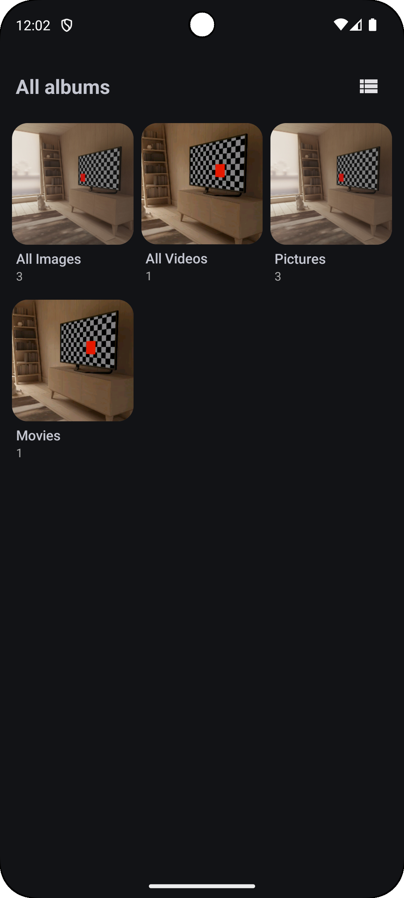
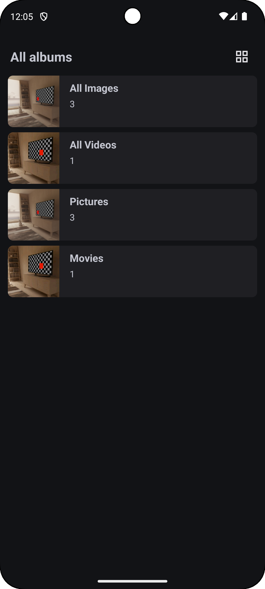
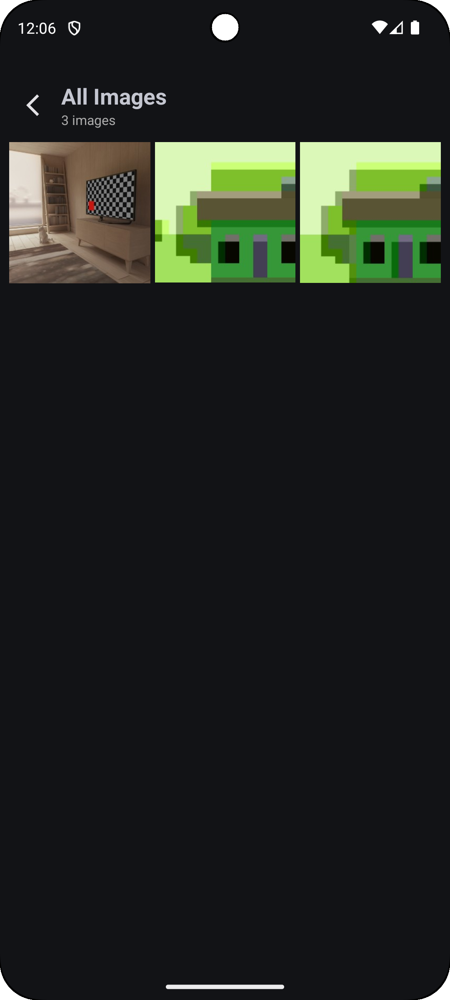
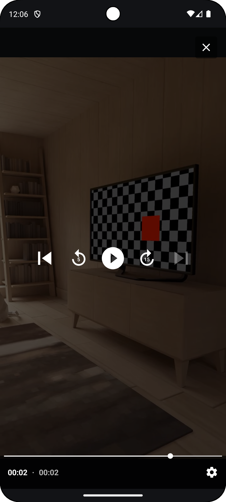

# 📸 MyGallery - Android Media Gallery App

MyGallery is a modern Android application that allows users to browse, view, and manage media files (images and videos) stored on their device. It's built using Kotlin, Android Jetpack libraries, and follows modern Android development best practices.

## 🚀 Features

*   **Browse Media:** View all images and videos in a grid layout.
*   **Album View:** Organize media into albums (folders).
*   **Switch Album View:** Albums Screen has extra option to switch form grid to linear & vice versa to change the view mode.
*   **Media Detail View:** View individual images and videos in full screen.
*   **Dark Mode Support:** Provides a comfortable viewing experience in low-light environments with a dark theme.
*   **Smooth Scrolling:** Efficiently loads and displays large numbers of media files using the Paging library.
*   **ContentObserver:** Observes the media store for changes and updates the UI accordingly.
*   **Clean Architecture:** Follows a clean architecture pattern for maintainability and testability.
*   **Hilt:** Uses Hilt for dependency injection.
*   **Navigation:** Uses the Navigation component for in-app navigation.
*   **AlertDialog:** Uses alert dialog for showing error and permission.
---
## 🛠️ Tech Stack

*   **Kotlin:** The primary programming language.
*   **Android Jetpack:**
    *   **Paging 3:** For efficient loading and display of large datasets.
    *   **ViewModel:** For managing UI-related data and lifecycle.
    *   **Navigation:** For in-app navigation.
    *   **Lifecycle:** For managing component lifecycles.
*   **Glide:** For image loading and caching.
*   **Hilt:** For dependency injection.
*   **Coroutines:** For asynchronous programming.
*   **MediaStore:** For accessing media files.
*   **ContentObserver:** For observing the media store.
---
## 🧩 Architecture

The app follows a clean architecture pattern, separating concerns into distinct layers:

*   **UI Layer:**
    *   **`Activities`:** Entry points for the app.
    *   **`Fragments`:** Responsible for displaying the UI and handling user interactions.
    *   **`ViewModels`:** Responsible for preparing and managing UI-related data.
    *   **`Adapters`:** Responsible for displaying data in `RecyclerViews`.
*   **Data Layer:**
    *   **`PagingSource`:** Responsible for fetching media data from the `MediaStore`.
    *   **`MediaStore`:** Android's API for accessing media files.
    *   **`MediaRepository`:** Responsible for fetching albums from the `MediaStore`.
* **Utils:**
    * **`DialogUtils`:** For showing alert dialog.
    * **`GridSpacingItemDecoration`:** For adding spacing in grid layout.
    * **`MediaContentObserver`:** For observing the media store.
---
## 🧩 Setup and Installation

1.  **Clone the Repository:**
```bash
    git clone https://github.com/sushanthrdy/MyGallery.git
    cd MyGallery
```
2.  **Open in Android Studio:**

    *   Open Android Studio and select "Open an existing Android Studio project."
    *   Navigate to the cloned repository and select the root directory.

3.  **Build and Run:**

    *   Click the "Run" button (green play icon) in Android Studio.
    *   Select an emulator or a connected device to run the app.
---
## 📸 Screenshots  

<div>




</div>

---
## 🤝 Contributing  

Contributions are welcome! Please fork the repository and create a pull request.  
To submit a pull request, follow these steps:

1. Fork the repository.
2. Create a new branch (`git checkout -b feature-name`).
3. Commit your changes (`git commit -am 'Add feature'`).
4. Push to the branch (`git push origin feature-name`).
5. Create a new pull request.

---

## 📜 License  

This project is licensed under the [Apache License 2.0](LICENSE).  
